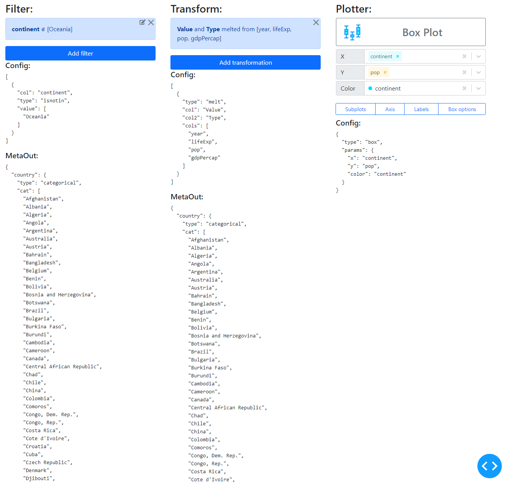

# Separated components

The components for filtering, transformations or the plotter can also be also used on their own.

Here a small example, to create sub configurations and check the transformed metadata.

